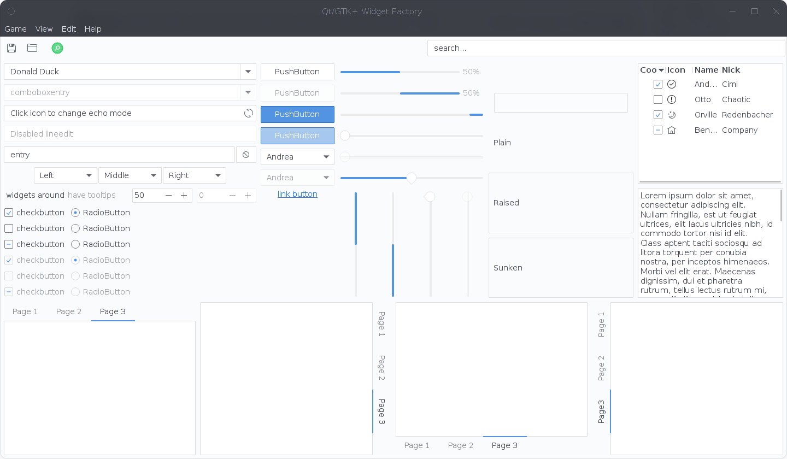
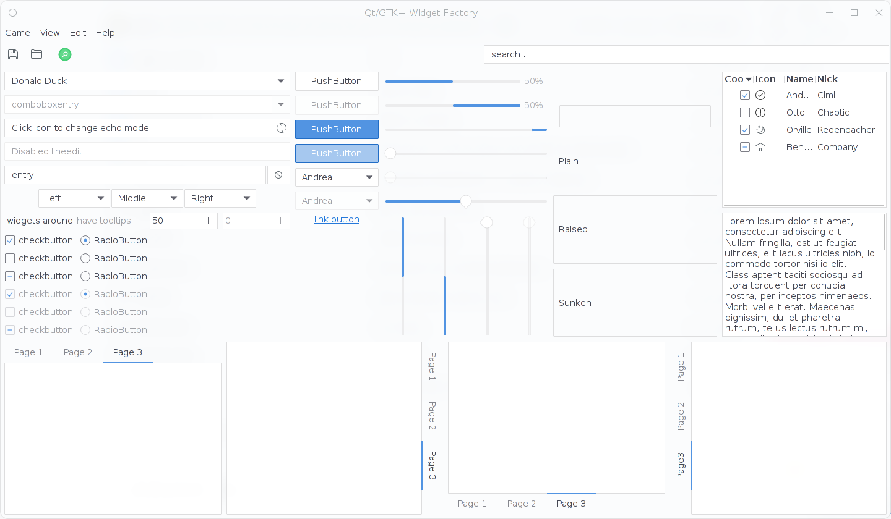
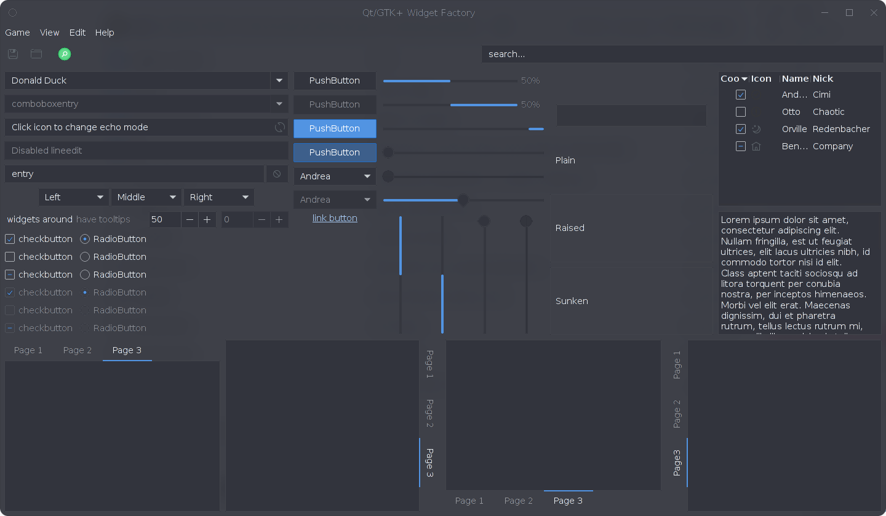

qogir-adwaita-qt
================

A native style to bend Qt5/Qt6 applications to look like they belong into GNOME Shell.

This style provides all 3 variants of GTK Qogir theme:

* Qogir Adwaita


* Qogir Adwaita-Light


* Qogir Adwaita-Dark


## How to compile

The project uses the standard CMake buildsystem.

So for example, the whole compilation process could look like this:

```
mkdir build
cd build
cmake -DCMAKE_INSTALL_PREFIX:PATH=/usr [-DUSE_QT6] ..
make
make install
```

## Usage

After install, you'll be able to either set the theme as your default via your DE's tools (like `systemsettings` or `qt-config`) or start your qt applications with the `-style adwaita` parameter.
